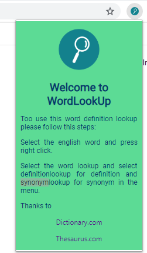
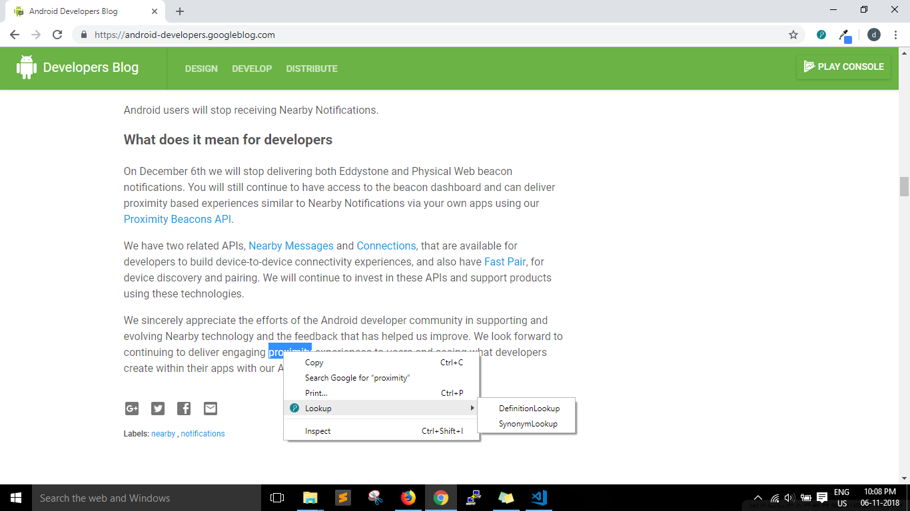

# Word Lookup
Designed and developed a chrome extension to lookup the definition, synonym for the selected word.

## Getting Started

These instructions will get you a copy of the project up and running on your local machine for development.

### Prerequisites

* Install the [Chrome Browser](https://www.google.com/chrome/)

### Installing

A step by step series of examples that tell you how to get a development env running.
* Open the chrome browser.
* Type this in the chrome url search bar.
```
chrome://extensions/
```
* Enable the developer mode.
* Select the load unpacked option and select the wordlookup folder.


## Built With

* Javascript


## Screenshots
  * Extension UI
   
  * Usage
  
  
## Authors

* **Srirama Dheeraj** - [DheerajRam13](https://github.com/dheerajram13/)

## Credits

* **dictionary.com** - [dictionary.com](https://www.dictionary.com/)


